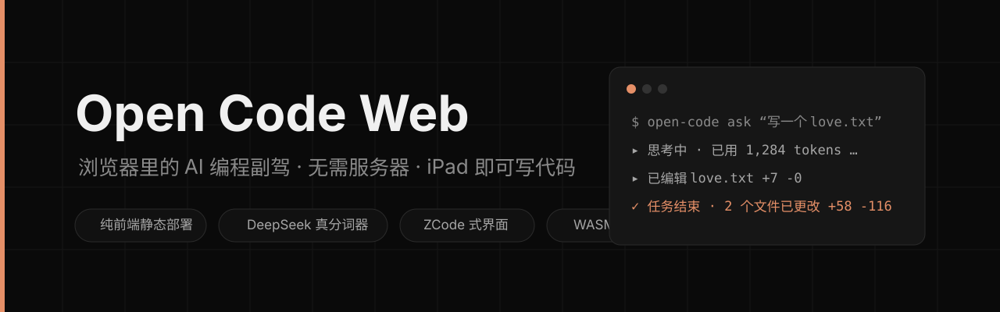
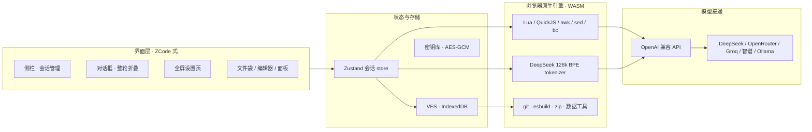
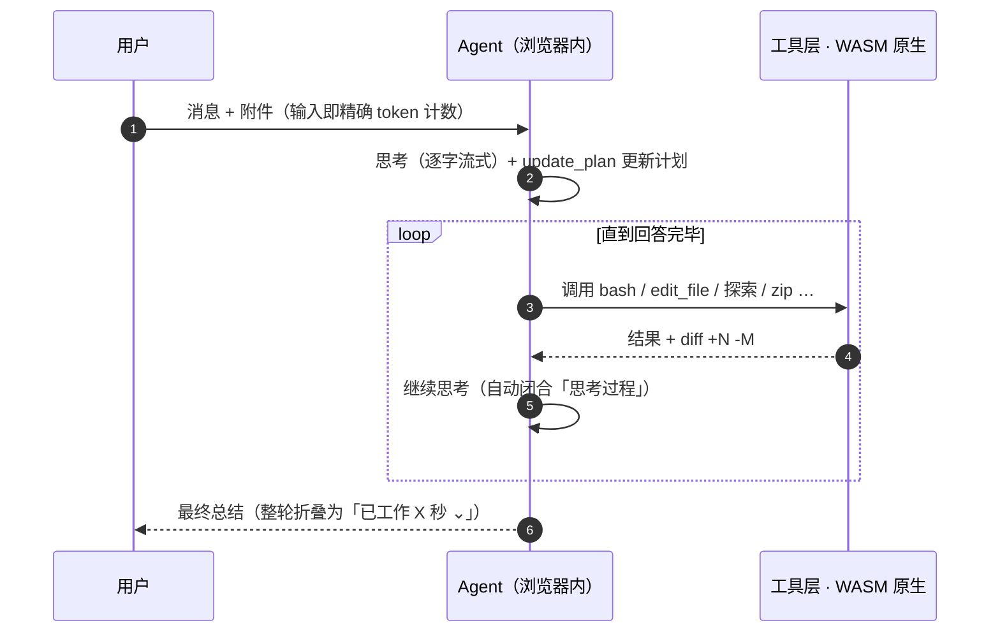

<div align="center">



**把 AI 编程工作台整个搬进浏览器 — 打开即用，无需服务器，没有账号，iPad 也能写代码。**

[](LICENSE)
[](https://nextjs.org)
[](https://react.dev)
[](https://github.com/pmndrs/zustand)
[](.github/workflows/deploy.yml)
[](https://github.com/5849mog/OpenCodeCLI/pulls)
[](CHANGELOG.md)

</div>

---

## 为什么会有它

夜深了。你在沙发上，手边只有一台 iPad。想改两行代码 —— 开电脑太重，SSH 太慢，租云端又贵得离谱。

**Open Code Web 解决的就是这一刻**：克隆仓库、配一个 API Key，然后你的 iPad / 手机 / Chromebook 就拥有了一位随叫随到的「AI 编程副驾」。所有文件、会话、密钥都活在你自己的浏览器里 —— 没有任何服务器，就没有任何人是你的管理员。

| 🧮 精确 | ⚡ 原生 | 🔒 自持 | 🚀 即用 |
|---|---|---|---|
| DeepSeek 官方 128k BPE 真分词器，token 消耗逐字节可查 | Lua / QuickJS / awk / sed / bc / git / zip 全部 WASM 原生跑在浏览器 | 密钥 AES-GCM 加密、永不导出，会话可一键导入导出 | 纯静态构建产物，扔上 GitHub Pages 即部署，iPad 添加到主屏秒开 |

---

## 目录

- [功能总览](#功能总览)
- [架构总览](#架构总览)
- [Agent 是怎么工作的](#agent-是怎么工作的)
- [Token 精确性：DeepSeek 真分词器](#token-精确性deepseek-真分词器)
- [安全模型](#安全模型)
- [界面预览（截图待补充）](#界面预览截图待补充)
- [快速开始](#快速开始)
- [部署到生产（iPad 可用）](#部署到生产ipad-可用)
- [Slash 命令与图形入口](#slash-命令与图形入口)
- [开发与测试](#开发与测试)
- [常见问题](#常见问题)
- [生态](#生态)
- [贡献](#贡献)
- [许可与鸣谢](#许可与鸣谢)

---

## 功能总览

### 🧠 智能体核心

- **多步 Agent 循环**：自主思考 → 计划 → 调用工具 → 观察结果 → 迭代，44 个工具自由组合，工具结果带真实 `+N -M` diff 预览
- **子智能体 (Explore)**：多文件探索委派给专用子代理，独立上下文、只回结论，主对话永远干净
- **实时思考流**：思考过程逐字流出，结束后自动闭合为「思考过程 持续了几秒」
- **整轮对话折叠**：每个任务只留「已工作 X 分 X 秒 ⌄」+ 最终总结，点击向下弹出全部执行轨迹，任务完成后自动收起 —— 对话流全程清爽
- **Plan / Bypass 双模式**：`Shift+Tab` 一键切换。Plan 模式 bash 只读、改动必须先过计划；Bypass 全自动直改
- **计划追踪**：`update_plan` 自动注入系统提示词，AI 永不「失忆」；右侧 Plan 面板实时看进度
- **结构化问答**：AI 弹出现场表单（单选 / 多选 / 文本），你答完才继续
- **Skill 技能包**：内置 + 自定义 Skill，AI 可以**自己创建和删除**技能，自定义技能独立持久保存
- **联网能力**：`web_search`（Tavily / Brave，皆有免费额度）+ `fetch_url`（Jina Reader 代理，跨站照抓）
- **三档运行模式**：完整 / 精简 / 极简，极简档固定开销从 ~26K 降到 ~2K tokens；会话内锁定保证前缀稳定，持续命中 API 缓存

### 🔧 浏览器里的「原生」工具箱

| 领域 | 引擎 | 说明 |
|---|---|---|
| **命令行** | 沙箱 bash | 管道 / 变量 / for 循环；`base64`、`printf`、`cat` 多文件随开随用 |
| **系统级语言** | **Lua 5.4 / QuickJS / One True awk / GNU sed / bc** | 官方解释器编译成 WASM，不是 JS 仿真 —— `run_lua` / `run_js` 直接运行 |
| **版本控制** | isomorphic-git + lightning-fs | init / status / add / commit / log / diff，全程在浏览器内 |
| **代码校验** | esbuild-wasm | TS / JSX 转译与语法检查，AI 改完代码当场验 |
| **数据处理** | YAML / PapaParse / JSONata / mathjs | 表格、JSON、矩阵、单位换算一站集齐 |
| **文件编辑** | edit_file / multi_edit / apply_patch / insert_at / undo_edit | 每个改动一张卡：路径、`+N -M`、diff 展开一次看完 |
| **压缩归档** | JSZip | 上传 `.zip` **自动解压**入工作区，`zip_archive` / `unzip_archive` 随写随打 |
| **可视化** | Mermaid / Graphviz(DOT,WASM) / Chart.js / KaTeX | Markdown 代码块直接渲染流程图、关系图、图表、公式 |

### 🎨 界面：像素级对标 ZCode

- **深色中性主题**：纯黑主区 + 灰阶分层 + 橙色点睛（完全访问徽标 / 当前会话圆点 / 开关拨杆）
- **两层命令框**：输入区 + 底部工具栏（`+` 附件、橙色「完全访问」徽标、`⚙ 模型`、`⚡ 思考强度`、圆形发送键）
- **首页**：问候语、快捷建议、功能卡片、装饰 Logo，干净得像一张便签
- **侧栏**：新建任务 `⌘N` / 搜索 `⌘K` / Skill / 文件袋，平铺会话列表、当前会话高亮置顶、hover 直接重命名/删除
- **全屏设置页**：左侧分类导航（基础设置 / Agent 能力 / 数据与统计）+ 右侧卡片化表单，ZCode 式圆角开关
- **对话质感**：用户消息圆角气泡 + 铅笔原地改写（发送后替换消息并重建对话）；AI 回复带复制 / 点赞 / 点踩 / 重新生成
- **Chat 即文档**：GFM 表格、任务清单、代码高亮（Prism）；点击工具结果里的文件路径直接打开 CodeMirror 编辑器，`Ctrl+S` 保存

### 💾 数据与持久化

- **文件袋 (VFS)**：IndexedDB 虚拟文件系统，随时 `/undo` 回滚一切写入（连 bash / sed / git 的写入都能撤）
- **会话管理**：多会话平铺 + 标题搜索 + `⌘N/⌘K` 快捷键；`/export` 导出 Markdown / JSON，设置页支持**整库导出 / 导入覆盖**
- **用量审计**：每次工具调用、文件变更（真实 `+N -M`）、token 消耗与成本估算（USD）全部入账，按 main / 子代理 / 编排分源记录

---

## 架构总览



每一条数据路径都发生在**你的浏览器里**：AI 只拿到「请求 → 应答」，项目文件、密钥、会话历史从不离开本地。

---

## Agent 是怎么工作的



全程没有服务器中转：模型返回什么、你看到什么，中间只有你的浏览器。

---

## Token 精确性：DeepSeek 真分词器

绝大多数同类产品用「字符数 ÷ 4」估算 token —— 误差 ±15% 起步。我们直接内置了 **DeepSeek-V3 官方 128k BPE 词表**：

```mermaid
flowchart LR
    I[输入 / 附件] --> F[文本内容]
    I --> IMG[图片 → 384 tokens/张]
    F --> W[tokenizer worker<br/>@huggingface/tokenizers · WASM]
    W --> C[输入框 ≈N 实时计数]
    W --> Q[/tokens 精确占用]
    W --> M[/compact 前后对比]
    W --> T[发送前预算截断 & auto-compact 85% 判定]
```

- **逐字节一致**：与 Python `transformers` 同引擎，DeepSeek 模型计数分毫不差
- **实时可见**：输入框即时显示 `≈N tokens`（300ms 防抖 + LRU 缓存）；文本/代码类附件按内容精确分词，图片按 vision 计费口径 384/张
- **全链路精确**：auto-compact 的 85% 触发阈值、发送前截断、`/tokens` 当前上下文占用、`/compact` 压缩前后对比 —— 全部走真分词器
- **零延迟启动**：词表加载完成前自动用字符启发式兜底（±15%），首条消息不等待；加载完成后自动升级为精确计数

---

## 安全模型

- **密钥自持**：API Key 用 **AES-GCM** 加密（主密钥由 PBKDF2 派生），密文与主密钥都留在本地 —— 刷新 / 重开自动恢复，永不重填；支持一键清除 + 闲时自动锁定（默认 30 分钟）
- **密钥不外泄**：会话导出文件、Payload 查看器**绝不包含 API 密钥**；密钥不在 React 状态、不在 Zustand store、不在任何会话导出里
- **防 SSRF**：服务端请求 URL 白名单校验——拒绝 `localhost`、环回、私有与保留地址
- **Plan 只读**：计划模式下 bash 只读，所有改动先出计划再执行
- **零远程**：无后端、无遥测、无账号。你的代码、你的会话、你的 Key，永远只属于你的浏览器

---

## 界面预览（截图待补充）

> 📷 本 README 不内嵌产品截图 —— **等你亲自拍**。把截图放入 `assets/screenshots/`（如 `home.png`、`chat.png`、`settings.png`），再取消下方注释即可展示：

```md
<!--
| 首页（静态） | 对话（整轮折叠展开前） | 设置页 |
|---|---|---|
|  |  |  |
-->
```

界面按 **ZCode 深色风格 1:1 复刻**：纯黑主区、灰色层级、橙色点睛。如果你在视频里见过 ZCode 的「两层命令框」和「已工作 X 秒折叠对话」，现在你可以在任何浏览器里用到同款。

---

## 快速开始

**环境要求**：Node.js ≥ 20.9 · 一个 OpenAI 兼容的 API Key

```bash
# 1. 克隆并安装
git clone https://github.com/5849mog/OpenCodeCLI.git
cd OpenCodeCLI
npm install

# 2. 启动（默认 http://localhost:3000）
npm run dev
```

**3. 配置 API Key**：首次打开自动弹出设置页，填入 Key + Base URL 即可。内置快速预设：

```
OpenAI · DeepSeek · 智谱 (Zhipu) · Moonshot (Kimi) · OpenRouter · Groq
```

> 💡 没有付费 Key？**Groq** 免费额度很够用；或本地跑 **Ollama**（设置里手填 `http://localhost:11434/v1`，需开 CORS）。

**4.（可选）联网搜索**：设置 → 搜索与抓取，填入 Tavily / Brave Key（皆有免费额度）。`fetch_url` 开箱即用，详见 [WEB_TOOLS_GUIDE.md](WEB_TOOLS_GUIDE.md)。

**5. 开始工作**：上传项目文件夹（或让 AI 从零创建），把任务交给它。`Shift+Tab` 切到 Plan 模式先看计划，确认后切回 Bypass 直改。

---

## 部署到生产（iPad 可用）

项目是**纯静态导出**（`next.config.ts` 已设 `output: "export"`，构建产物在 `out/`）：

```bash
npm run build          # 生成 out/（子路径部署前先设 REPO_NAME）
npm run build:pages    # 或：根路径（username.github.io）一键构建 + .nojekyll
```

- **子路径**（`username.github.io/OpenCodeCLI/`）：`REPO_NAME=OpenCodeCLI npm run build`，构建器自动带上 basePath
- **自动部署**：本仓库自带 GitHub Actions（`.github/workflows/deploy.yml`），push 到 `main` 自动编译 bc / awk / lua / sed 的 WASM 并发布 GitHub Pages
- **任何静态托管**：Vercel / Netlify / Cloudflare Pages 直接指向 `out/` 即可

部署完成后，iPad 上 Safari 打开链接 → **添加到主屏幕** —— 就能像原生 App 一样全屏使用，临时外出改两行代码都不许带电脑。

---

## Slash 命令与图形入口

| 命令 | 用途 |
|---|---|
| `/help` | 全部命令速查 |
| `/clear` `/reset` | 清空会话（保留文件袋） |
| `/model <name>` | 不打开设置直接换模型 |
| `/compact` | LLM 把旧对话压成摘要，释放上下文（真分词器前后对比） |
| `/export` | 对话导出为 Markdown（`/export json` 导出 JSON） |
| `/cost` | 累计 API 开销估算（USD） |
| `/tokens` | 真实用量 + 当前上下文**精确**占用 |
| `/skills` | 列出可用 Skill 技能包 |
| `/undo` | 撤销上一次 AI 写入（快照一键回滚） |
| `/diff` | 本次会话全部文件变更 |

**图形入口**：右上角 = Payload 查看器（查看/编辑发给 AI 的完整上下文）、Token 用量面板；右侧栏 = 文件 / 变更 / 文件袋 / Plan / 子智能体；输入框 `⌘K` 搜索会话、`⌘N` 新建任务。

---

## 开发与测试

```bash
npm run dev            # 开发服务器（Turbopack）
npm run lint           # ESLint
npm run build          # 生产构建（静态导出）

# 测试套件
node scripts/e2e-preset.mjs   # 24 项：prompt 前缀稳定性、工具白名单等
node scripts/e2e-vision.mjs   # 5 项：视觉消息 token 计数
```

---

## 常见问题

**数据存哪？清缓存会丢吗？**
会话与文件袋在 IndexedDB。清站点数据 = 全量清空 —— 请定期在 Settings → 会话与备份「导出全部会话」，换设备后「导入并覆盖」。

**上下文用满了怎么办？**
两条路：手动 `/compact` 让 LLM 摘要旧对话；或开启自动压缩（真分词器估算超预算 85% 自动触发）。发送前也会按预算精确截断旧历史并压缩工具结果。

**为什么我上传的图片要花 384 tokens？**
这是 DeepSeek 视觉 API 的计费口径（自适应缩放后每张约 384 token），输入框的 `≈N` 计数跟你真实的账单保持同一口径。

**`fetch_url` 报 "Failed to fetch"？**
目标站点禁了 CORS。会自动尝试 Jina Reader 代理；仍失败则在设置 → 网页抓取里配置自定义 CORS 代理。

---

## 生态

| 文档 | 说明 |
|---|---|
| [CHANGELOG.md](CHANGELOG.md) | 21 天 / 188 次提交的完整成长日志，按日期倒序、每条直达 commit（`node gen-changelog.mjs` 可重新生成） |
| [WEB_TOOLS_GUIDE.md](WEB_TOOLS_GUIDE.md) | web_search / fetch_url 联网能力的完整配置指南 |

---

## 贡献

一人独养之物，广纳 Issue 与 PR：
- 想修 bug 或加功能 → 开 Issue 说清楚场景，或直接 PR
- 想聊聊「浏览器端 Agent」的巧思 → Issue 里我们泡杯茶慢慢聊

---

## 许可与鸣谢

[MIT](LICENSE)

- [Open Code](https://github.com/sindresorhus/open-code) — 界面与交互灵感
- [Claude Code](https://claude.ai/code) — 交互设计启发
- [One True Awk](https://github.com/onetrueawk/awk) · [quickjs-emscripten](https://github.com/justjake/quickjs-emscripten) — WASM 原生引擎
- **ZCode** — 界面像素级复刻与「整轮对话折叠」的样板
- 每一位试用、反馈、提 PR 的你

---

<div align="center">

**这不是 VSCode 或 Cursor 的替代品 ——**

**但它会在你只有 iPad 的夜里，陪你写一会儿代码。** 🚗💨

</div>
